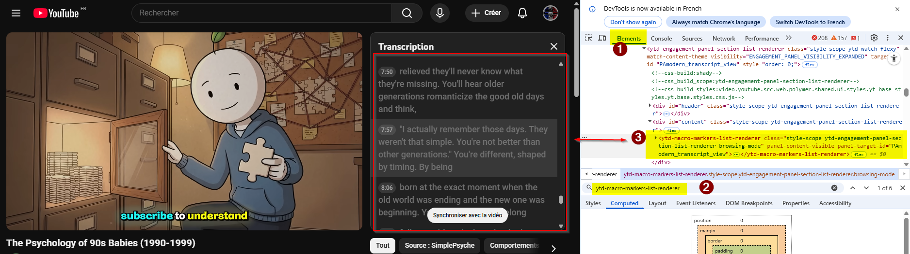
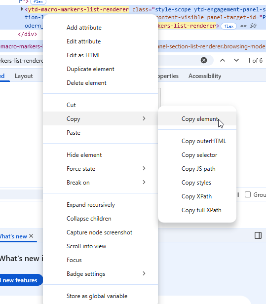

# YoutubeTranscriptToText

Small utility to extract timestamps and their associated transcript text from a YouTube transcript HTML dump or directly from YouTube URLs.

How it works
- For HTML files: The script strips HTML tags and uses a simple regex to find timestamps (e.g. `0:00`, `1:06`).
- For YouTube URLs: The script fetches the transcript using the YouTube API and converts it to the same format.
- For each timestamp it captures the following text up to the next timestamp and outputs pairs in the selected format.

## Requirements
- Python 3 (tested on 3.8+)
- `youtube-transcript-api` (optional, only required for YouTube URL inputs): `pip install youtube-transcript-api`

## Usage

Interactive (default): the script will ask a few numbered questions when run without `--format` or `-o`:

1) Whether to include timestamps in the output
	- `1)` With timestamps (default)
	- `2)` Without timestamps

2) Output format (choose the option number)
	- `1)` `tsv` (default)
	- `2)` `txt`
	- `3)` `md`

3) Output filename (enter a name without extension). Press Enter to use the default `output`. For URLs, default base is `transcript`.

Example (interactive with file):

```bash
python extractor.py example.txt
```

Example (interactive with URL):

```bash
python extractor.py https://www.youtube.com/watch?v=dQw4w9WgXcQ
```

Non-interactive (flags): you can skip prompts by providing `--format` and/or `-o`:

```bash
python extractor.py example.txt -o output.tsv --format tsv
```

```bash
python extractor.py https://www.youtube.com/watch?v=dQw4w9WgXcQ -o transcript.tsv --format tsv
```

When running non-interactively the provided `-o/--output` should include the extension (e.g. `output.tsv`).

Supported formats:
- `tsv` — tab-separated file: `TIME<TAB>TEXT` (or `TEXT` only if you chose to omit timestamps)
- `txt` — plain text lines: `TIME - TEXT` (or `TEXT` only when timestamps are omitted)
- `md` — Markdown table. If timestamps are included the table is `Time | Text`; when timestamps are omitted the table contains a single `Text` column.

### Files
- `extractor.py` — extraction script
- `example.txt` — example HTML transcript (input)
- `requirements.txt` — Python dependencies

### Notes
- For YouTube URLs, the script automatically tries multiple languages (English, Spanish, French, German, Italian, Portuguese, Russian, Japanese, Korean, Chinese) to find an available transcript.
- If no transcript is available for the video, the script will output an error and produce an empty file.
- Interactive defaults: choosing Enter for the filename uses `output` as the base name; the selected format determines the file extension.
- The script is intentionally simple and dependency-free. It works well for the HTML structure produced by YouTube's transcript/timeline markup. If your transcripts use a different markup, the parser can be adapted.


# Guidance on how to get the useable HTML tag with this script

## Step by step
1. Inspect page
2. In the "Elements" pane just search for the HTML tag corresponding to the transcript :



3. Copy the HTML tag



4. Paste in "example.txt"

5. run python script from your terminal :
```bash
python extractor.py example.txt
```
